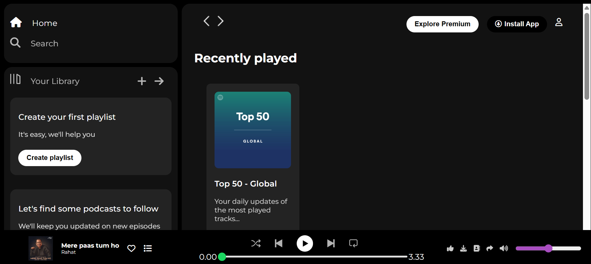

# Pulseify 🎵

Pulseify is a Spotify-inspired music streaming UI built using HTML5 and CSS3.  
The project focuses on creating a modern, immersive, and responsive user interface with playlist sections, sidebar navigation, music player controls, and interactive design elements.

---

## 🚀 Live Demo

🔗 Live Website: https://rahilatabassum.github.io/pulseify-music-ui/

---

## 📌 Features

- Responsive music streaming interface
- Sidebar navigation menu
- Sticky navigation bar
- Playlist and featured charts sections
- Interactive hover effects
- Music player layout
- Modern dark-themed UI
- Card-based responsive design
- Smooth and immersive user experience

---

## 🛠️ Tech Stack

- HTML5
- CSS3
- Flexbox
- Responsive Design
- Font Awesome
- Google Fonts

---

## 📂 Project Structure

```bash
pulseify-music-ui/
│
├── index.html
├── style.css
│
├── assets/
│   
│   
│   
│
└── screenshots/
```

---

## 📸 Screenshots

### Home Interface



---

## 💡 Learning Outcomes

Through this project, I improved my understanding of:

- Responsive web design
- Flexbox layouts
- UI structuring and alignment
- Modern music platform interfaces
- CSS positioning and styling
- Interactive frontend components

---

## 🔮 Future Improvements

- Add JavaScript functionality
- Integrate real music playback
- Add playlists and search functionality
- Improve mobile responsiveness
- Add animations and transitions

---

## 👩‍💻 Author

Developed by **Rahila Tabassum**

GitHub: https://github.com/RahilaTabassum

---

## ⭐ Support

If you like this project, consider giving it a ⭐ on GitHub!
